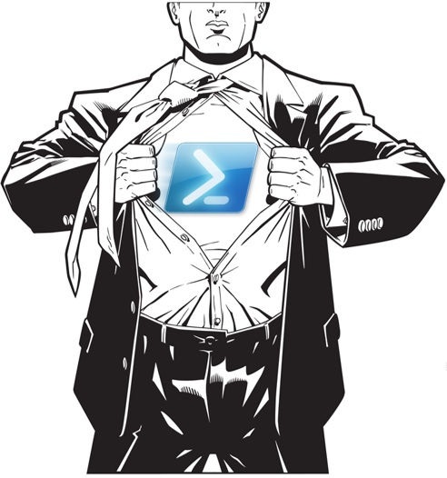

# PowerShell Advanced Scripting Techniques

- [PowerShell Advanced Scripting Techniques](#powershell-advanced-scripting-techniques)
- [Prerequisites](#prerequisites)
- [Modules](#modules)
  - [Module 1: `PowerShell foundation workshop recap `](#module-1-powershell-foundation-workshop-recap-)
  - [Module 2: `WMI & CIM`](#module-2-wmi--cim)
  - [Module 3: `PSCustomObject`](#module-3-pscustomobject)
  - [Module 4: `Advanced Functions`](#module-4-advanced-functions)
  - [Module 5: `Debugging`](#module-5-debugging)
  - [Module 6: `Error Handeling`](#module-6-error-handeling)
  - [Module 7: `GIT`](#module-7-git)
  - [Module 8: `PowerShell Jobs`](#module-8-powershell-jobs)

---
# Prerequisites
- Graduation from the `PowerShell Foundation workshop` (or equivalent knowledge):
Participants should have completed a foundational workshop or training program focused on PowerShell. This ensures that they have a basic understanding of PowerShell's core concepts, cmdlets, variables, loops, and conditional statements. Alternatively, participants should possess equivalent knowledge gained through practical experience or self-study.
- Experience with `PowerShell` or other scripting languages:
Participants should have prior experience working with PowerShell or other scripting languages such as `Python`, `Bash`, or `Ruby`. This experience includes familiarity with scripting concepts, basic syntax, and common scripting tasks like variable assignment, function definition, and control flow structures.
   
Having these prerequisites in place ensures that participants have a solid foundation in PowerShell and scripting, enabling them to grasp the advanced topics covered in the modules effectively.
 
 
 

---
# Modules
## Module 1: `PowerShell foundation workshop recap `

1.  Object Model
2.  Identify Properties and Methods for anObject
3.  Variables
4.  Pipeline Introduction
5.  Pipeline Object Manipulation
6.  Import/Export cmdlets
7.  Cmdlets and Pipeline Variable
8.  Foreach-Object & Where-Object
9.  Pipeline Processing
10. Pipeline Input
11. Functions & Parameters
12. Scripts & Script Blocks
13. Execution Policies
14. Arrays and Hash Tables
15. PowerShell Remoting Basics
 
 

## Module 2: `WMI & CIM`

1. What is this repository?
2. How do I query it?
3. How do I use methods in WMI and CIM?
4. What is the difference between WMI and CIM?

## Module 3: `PSCustomObject`

1. What is PSCustomObject?
2. When shoud I use it?
3. Creating modifing and removing properties
4. Adding methods to our PSCustom object
5. Changing our PSCustom types
6. Exporting and Importing our PSCustomObjects

## Module 4: `Advanced Functions`

1. Basic function recap
2. Scopes
3. Parameter Basics
4. The Parameter Attribute
5. Parameter Attribute validators
6. Cmdlet binding
7. Streams

## Module 5: `Debugging`

1. Syntax errors
2. Line Break Points
3. Step over / Step into / Step out
4. Variable & Command breakpoints

## Module 6: `Error Handeling`

1. Terminating and Non-Terminating Errors
2. Working with ErrorRecord Object
3. Non Terminating Errors Handaling Flow
4. Terminating Errors (Try/Catch/Finally)

## Module 7: `GIT`

1. Overview of GIT - Git design
2. Logging into a Git repository
3. Branch-Merging

## Module 8: `PowerShell Jobs` 

1. Overview
2. Starting a Background Job
3. Working with Job Objects
4. Managing Background Jobs
5. Remote Background Jobs
6. Scheduled Jobs
7. Scheduled Tasks
8. Scheduled Tasks VS Scheduled Jobs